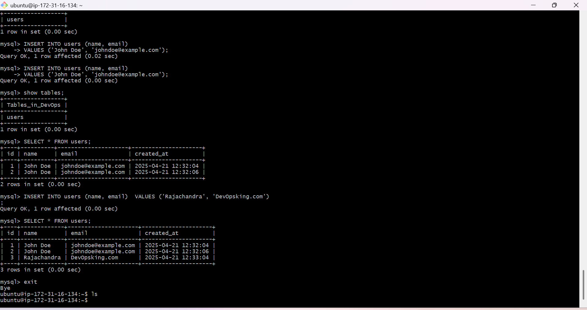
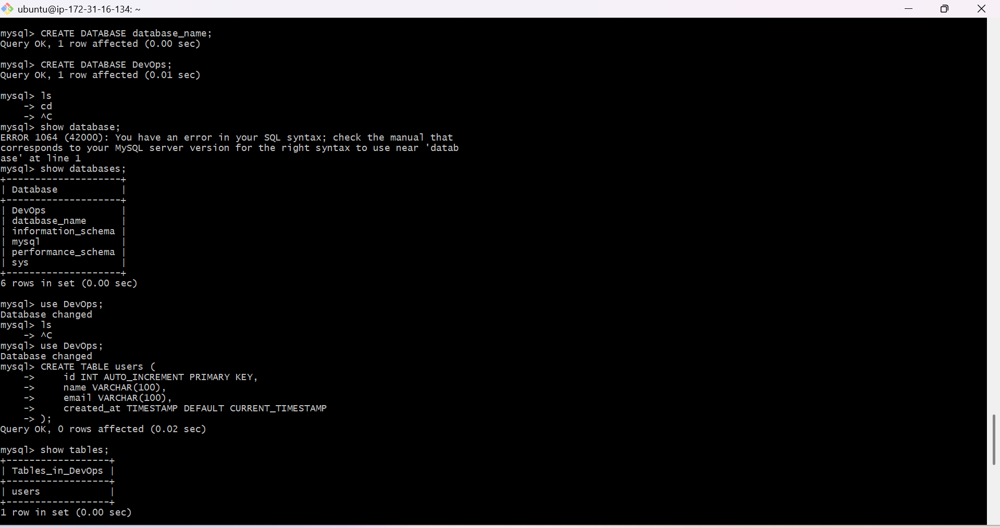
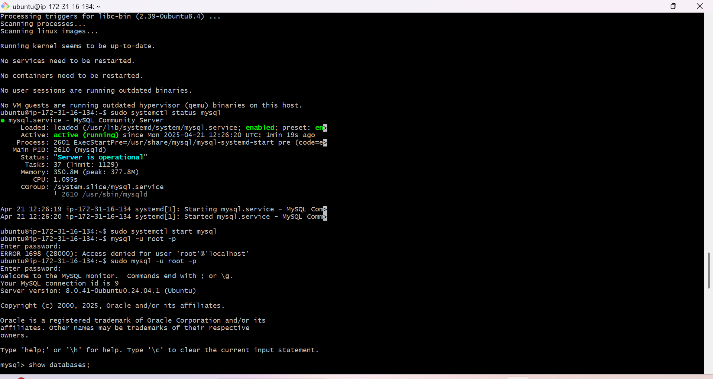

# MySQL Installation in Linux Steps

## Step 1: Open the terminal
To start, you'll need to open the terminal or command line on your system. This is where you will input all of the commands.

---

## Step 2: Update package lists
```bash
sudo apt update
```
This command updates the list of available software packages on your system to make sure you're installing the latest versions. The `sudo` command allows you to run this as an administrator.

---

## Step 3: Clear the terminal screen
```bash
clear
```
Clears the terminal screen for better visibility, so you don't have old text cluttering the terminal.

---

## Step 4: Check MySQL version 
```bash
mysql --version
```
This command shows you the current version of MySQL that is installed on your system (if it’s already installed).

---

## Step 5: Install MySQL client 
```bash
sudo apt install mysql-client-core-8.0
```
This command installs MySQL client tools on your machine. These tools let you interact with MySQL servers but don't include the server itself.

---

## Step 6: List the files 
```bash
ls
```
This command lists all the files in your current directory to help you keep track of what’s in there.

---

## Step 7: Start the MySQL server
```bash
sudo systemctl start mysql
```
This starts the MySQL service (i.e., the server). If MySQL is already installed but not running, you need to start it so you can interact with it.

---

## Step 8: Check the status of MySQL
```bash
sudo systemctl status mysql
```
This command shows you whether the MySQL service is running properly.

---

## Step 9: Start MySQL server if needed
```bash
sudo systemctl start mysqld
```
If you get an error with the previous command, this one starts the MySQL daemon (a background service). This is an alternative command if `mysql` doesn't start with `systemctl`.

---

## Step 10: Install MySQL server
```bash
sudo apt install mysql-server
```
This installs the full MySQL server, which allows you to run a MySQL database on your machine.

---

## Step 11: Log into MySQL
```bash
mysql -u root -p
```
This command lets you log into MySQL as the root user (the superuser of MySQL). The `-p` means you'll be asked to enter a password.

---

## Step 12: Using sudo to log into MySQL (If necessary)
```bash
sudo mysql -u root -p
```
If you don’t have direct access as root, you may need to use `sudo` to log into MySQL. This might be necessary if your MySQL installation was set up with special permissions.

---

## Conclusion
These steps will drive you in installing and starting MySQL, as well as logging into the MySQL server to interact with databases. If you follow the commands correctly, you should be able to have MySQL.








### 