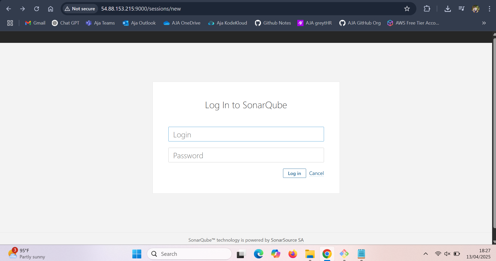
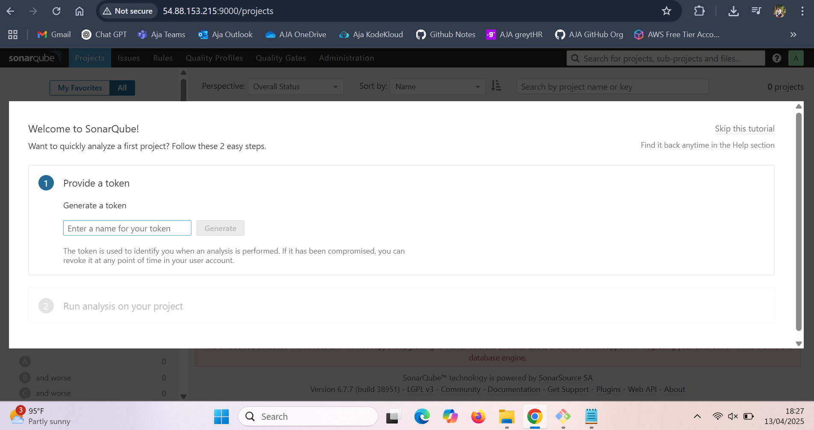
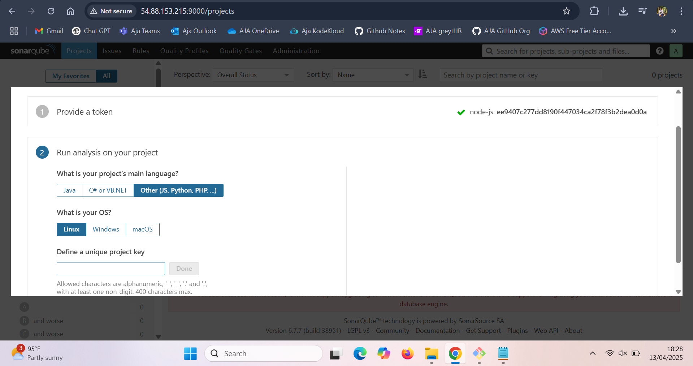
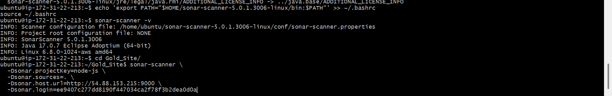
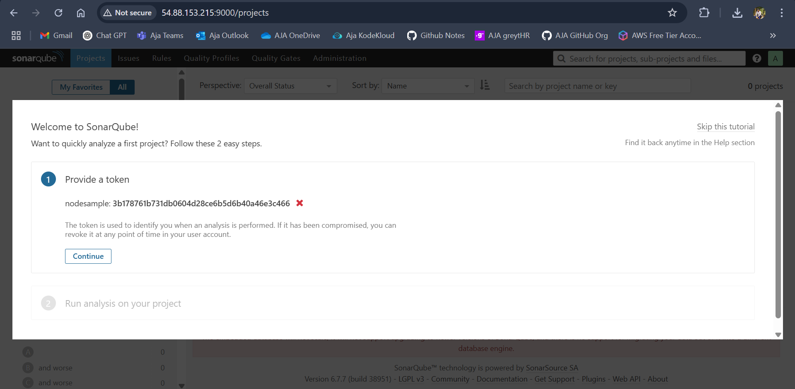
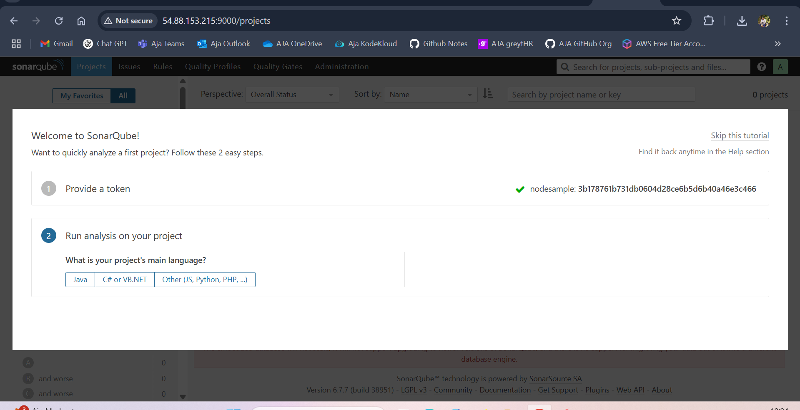
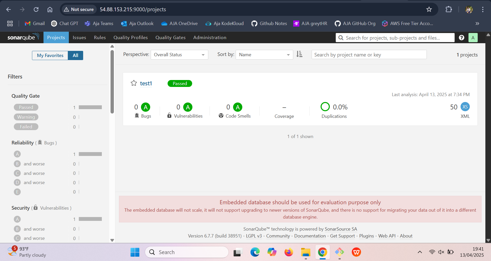
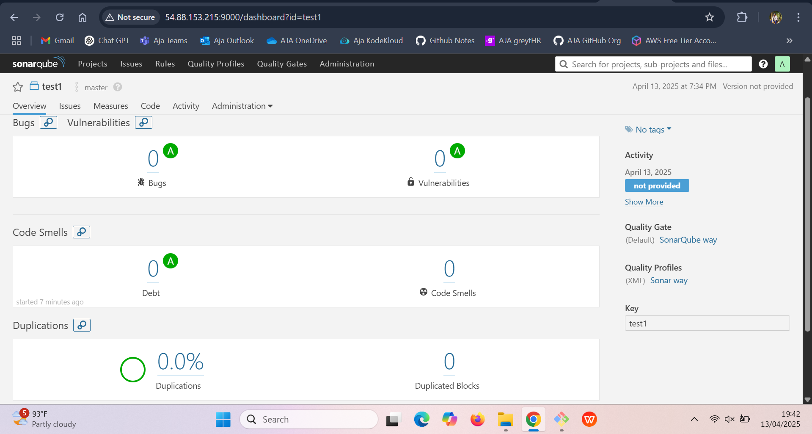
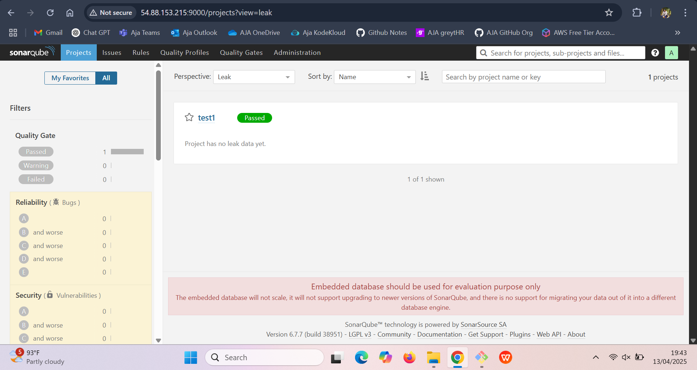

# Run Javascript Code test with Sonar Scanner 

## Pre-requisites:
- A Linux machine (like Ubuntu)
- An internet connection
- A JavaScript based code (e.g., `~/Gold_Site`)
- Access to a running SonarQube server (we use: `http://54.88.153.215:9000`)
- A **SonarQube token** (we use a sample here)

---

## Step 1: Update Your System

Keep things fresh before installing anything.

```bash
sudo apt update
```

---

## Step 2: Install Java 8 (Required by Some SonarScanner Versions)

```bash
sudo apt install openjdk-8-jdk
```

Check Java version:

```bash
java -version
```

---

## Step 3: Set Java 8 as the Default

List available Java versions:

```bash
update-java-alternatives --list
```

Select Java 8 manually:

```bash
sudo update-alternatives --config java
```

Set Java 8 environment variables:

```bash
export JAVA_HOME=/usr/lib/jvm/java-8-openjdk-amd64
export PATH=$JAVA_HOME/bin:$PATH
```

---

## Step 4: Download and Unzip SonarScanner

You can try either version — sometimes newer ones may not work well with Java 8.

### Option A: Newer Version (5.0.1)

```bash
wget https://binaries.sonarsource.com/Distribution/sonar-scanner-cli/sonar-scanner-cli-5.0.1.3006-linux.zip
unzip sonar-scanner-cli-5.0.1.3006-linux.zip
cd sonar-scanner-5.0.1.3006-linux
```

### Option B: Older Version (3.3.0)

If the above version gives issues, try:

```bash
wget https://binaries.sonarsource.com/Distribution/sonar-scanner-cli/sonar-scanner-cli-3.3.0.1492-linux.zip
unzip sonar-scanner-cli-3.3.0.1492-linux.zip
cd sonar-scanner-3.3.0.1492-linux
```

---

## Step 5: Go to Your Java Project Folder

```bash
cd ~/Gold_Site
```

Make sure your Java files are inside this folder.

---

## Step 6: Run the Code Scan

Use this command to run the scan. Replace the token with your actual SonarQube token:

```bash
./path/to/sonar-scanner/bin/sonar-scanner \
  -Dsonar.projectKey=test1 \
  -Dsonar.sources=. \
  -Dsonar.host.url=http://54.88.153.215:9000 \
  -Dsonar.login=3b178761b731db0604d28ce6b5d6b40a46e3c466
```

### Example for Current Folder:

If you're already in the SonarScanner folder, run:

```bash
./bin/sonar-scanner \
  -Dsonar.projectKey=test1 \
  -Dsonar.sources=. \
  -Dsonar.host.url=http://54.88.153.215:9000 \
  -Dsonar.login=3b178761b731db0604d28ce6b5d6b40a46e3c466
```

---

## Step 7: View the Results on SonarQube

Open this link in your browser:

```
http://54.88.153.215:9000
```

Log in with your token or credentials, and you should see the scan results for `test1`.





























## Done!

You just:
- Installed Java 8
- Set up SonarScanner
- Scanned a project
- Viewed the code analysis in SonarQube


