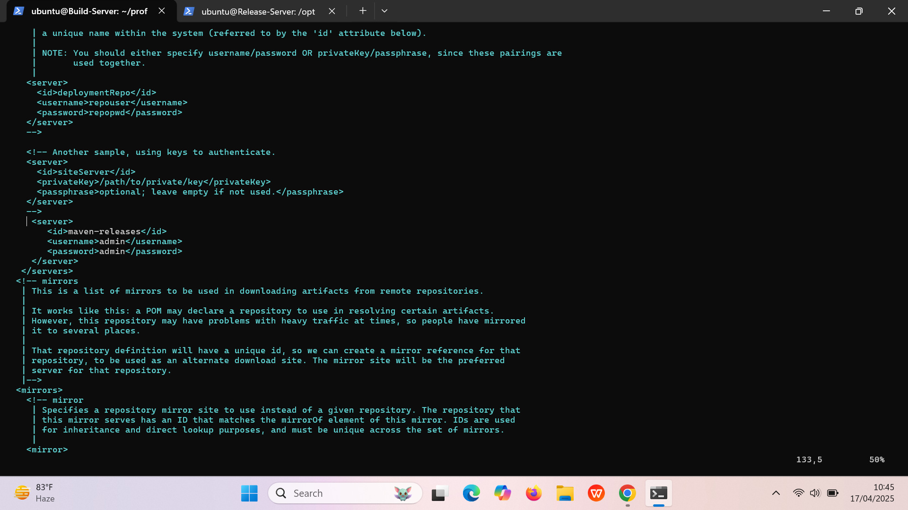

# Nexus :-
Nexus is a tool known as a repository manager, which helps manage and organize software components like binaries and packages.

These components can include things like libraries, code modules, or even Docker images.

Nexus supports several formats such as Maven, npm, and Docker, and it is often used in combination with CI/CD pipelines (Continuous Integration/Continuous Delivery) to streamline the development process.

By using Nexus, we can:

Store and organize all their software artifacts in a single, centralized place.

Control access and enforce security rules for critical software components.

Keep backups of all versions of artifacts, ensuring nothing is lost and everything is accessible when needed.

---
## Release Server Setup: Installing and Configuring Nexus Repository 
### Minimum System Requirements for Nexus Repository
###  Cores: 2 CPUs
### Memory: 4 GB of RAM
### Port: Ensure port 8081 is open for access.
---


### **Release Server Setup (Nexus)**
1. **Update the system packages:**
   - As with the build server, it's important to ensure that the system is up-to-date before installing new software.
   - Run the following command to refresh the system's package lists:
     ```bash
     sudo apt update -y
     ```

2. **Install OpenJDK 11 (Headless):**
   - Nexus requires Java to run, so install the OpenJDK 11 headless package, which doesn't include the GUI components but provides the necessary runtime for Nexus.
   - Install it by running:
     ```bash
     sudo apt install openjdk-11-jdk-headless -y
     ```

3. **Verify Java installation:**
   - After installation, check the Java version to ensure it installed correctly. You should see OpenJDK 11 listed.
   - Verify by running:
     ```bash
     java --version
     ```

4. **Navigate to the `/opt` directory:**
   - The `/opt` directory is commonly used for installing optional or third-party software. Change to this directory before proceeding with Nexus installation.
   - Use the following command:
     ```bash
     cd /opt
     ```

5. **Download the Nexus installation package:**
   - Go to the official Nexus website and download the Nexus installation tarball (version 3.79.1-04 in this case).
   - Download using the `wget` command:
     ```bash
     sudo wget https://download.sonatype.com/nexus/3/nexus-3.79.1-04-linux-x86_64.tar.gz
     ```

6. **Extract the Nexus tarball:**
   - Once downloaded, extract the tarball to the `/opt` directory, which will create a folder containing all Nexus files.
   - Run the following command to extract:
     ```bash
     sudo tar -xvf nexus-3.79.1-04-linux-x86_64.tar.gz
     ```

7. **Create a user for Nexus:**
   - It's a good security practice to run Nexus under a dedicated user account. Create a new user named `nexus`:
     ```bash
     sudo adduser nexus
     ```

8. **Rename the extracted Nexus folder (optional):**
   - For better organization, rename the extracted Nexus folder to simply `nexus` to make it easier to reference.
   - Use:
     ```bash
     mv nexus-3.79.1-04 nexus
     ```

9. **Change ownership of the Nexus installation directory:**
   - Ensure that the `nexus` user has ownership of the Nexus directory to avoid permission issues when running the application.
   - Update the directory permissions with:
     ```bash
     sudo chown -R nexus:nexus /opt/nexus
     ```

10. **Change ownership of the Sonatype work directory:**
    - Similarly, ensure the `nexus` user owns the Sonatype work directory, where Nexus stores data.
    - Use the following command:
      ```bash
      sudo chown -R nexus:nexus /opt/sonatype-work
      ```

11. **Create a systemd service file for Nexus:**
    - To run Nexus as a service, create a `systemd` service file so it starts automatically on system boot and can be managed easily.
    - Create the service file with:
      ```bash
      sudo vi /etc/systemd/system/nexus.service
      ```
      Add the following content:
      ```ini
      [Unit]
      Description=Nexus Repository Manager
      After=network.target

      [Service]
      Type=forking
      User=nexus
      Group=nexus
      ExecStart=/opt/nexus/bin/nexus start
      ExecStop=/opt/nexus/bin/nexus stop
      Restart=always
      SuccessExitStatus=143

      [Install]
      WantedBy=multi-user.target
      ```

12. **Reload systemd to recognize the new Nexus service:**
    - After creating the service file, reload the `systemd` daemon to apply changes and make the Nexus service available for management.
    - Reload with:
      ```bash
      sudo systemctl daemon-reload
      ```

13. **Enable Nexus to start on boot:**
    - Set Nexus to start automatically when the system boots by enabling the service.
    - Enable the service:
      ```bash
      sudo systemctl enable nexus
      ```

14. **Start Nexus service:**
    - Start the Nexus service manually to begin using Nexus right away.
    - Run:
      ```bash
      sudo systemctl start nexus
      ```

15. **Check the status of Nexus service:**
    - After starting the service, verify that Nexus is running correctly by checking its status.
    - Use:
      ```bash
      sudo systemctl status nexus
      ```

16. **Install net-tools for networking utilities (optional):**
    - Sometimes it's helpful to have network tools like `netstat` to check open ports and network connections.
    - Install `net-tools` with:
      ```bash
      sudo apt install net-tools -y
      ```

17. **Check your public IP address:**
    - Use `curl` to quickly check your server’s public IP address if you need to access Nexus externally.
    - Run:
      ```bash
      curl ifconfig.me
      ```

18. **Check open ports and network connections:**
    - Use `netstat` to check which ports are open on your system and whether Nexus is correctly listening on the expected port.
    - Run:
      ```bash
      netstat -ntpl
      ```

19. **Retrieve the Nexus admin password:**
    - Once Nexus is running, retrieve the initial admin password required to log into the Nexus web interface.
    - Find the password using:
      ```bash
      cat /nexus-data/admin.password
      ```

20. **Alternatively, retrieve the admin password from the Sonatype work directory:**
    - If the password isn't found in the default location, it might be located in the `/opt/sonatype-work/nexus3` directory.
    - Run:
      ```bash
      cat /opt/sonatype-work/nexus3/admin.password
      ```

---
## **Build Server Setup (Maven)**

1. **Update the system packages:**
   - Before installing any new software, it's good practice to ensure that all existing packages on the system are up-to-date.
   - Run the following command to update all the available package lists on the system:
     ```bash
     sudo apt update -y
     ```

2. **Install OpenJDK 11 (Headless):**
   - Maven requires Java to build and manage the projects. OpenJDK 11 is a commonly used version of Java for modern applications.
   - Install the headless version of OpenJDK 11 (without the graphical components) using:
     ```bash
     sudo apt install openjdk-11-jdk-headless -y
     ```
   - Verify the Java installation with `java -version` to ensure it installed correctly.

3. **Install Maven:**
   - Maven is the build automation tool for Java projects. It’s required to manage project dependencies, build, and deploy Java applications.
   - Install Maven by executing the following command:
     ```bash
     sudo apt install maven -y
     ```

4. **Clone the Git repository containing the project:**
   - Maven works with projects that are stored in version control systems like Git. Cloning the repository gives you a local copy of the project.
   - Use the `git clone` command to fetch the project:
     ```bash
     git clone https://github.com/Ai-TechNov/profile-project.git
     ```

5. **Navigate to the project directory:**
   - Once the repository is cloned, move into the project directory where the Maven `pom.xml` file is located.
   - Change directory to the project folder using:
     ```bash
     cd profile-project/
     ```

6. **Edit Maven settings (`settings.xml`):**
   - The `settings.xml` file contains configuration for Maven repositories, proxies, and credentials for deployment. Edit this file if you need to configure Maven settings like repository credentials.
   - Open the file for editing using:
     ```bash
     sudo vim /etc/maven/settings.xml
     ```

7. **Deploy the project using Maven:**
   - After the project is configured, use Maven to deploy the project artifacts to the configured repository (such as Nexus).
   - Run the following command to deploy:
     ```bash
     mvn deploy
     ```

8. **Navigate to the target directory (where Maven builds output):**
   - After building the project, Maven stores the compiled files (JARs, WARs, etc.) in the `target` directory.
   - Go to the `target` folder:
     ```bash
     cd target/
     ```

9. **Open `pom.xml` for inspection or editing:**
   - The `pom.xml` file contains all the configurations for Maven, such as dependencies, plugins, and goals. You can inspect or edit this file if necessary.
   - Use `vi` or another text editor:
     ```bash
     vi pom.xml
     ```

10. **Clean the project (optional):**
    - Cleaning the project removes any compiled files from previous builds, ensuring that Maven starts fresh when rebuilding the project.
    - Run the clean command to delete the `target` directory:
      ```bash
      mvn clean
      ```

11. **Deploy the project again:**
    - After cleaning the project, run the deploy command again to deploy the latest build to your repository.
    - Use the following command:
      ```bash
      mvn deploy
      ```

12. **Reopen `pom.xml` if further changes are needed:**
    - If you need to make additional changes to the `pom.xml` file after the build process, you can open it again and edit it.
    - Open the file for editing:
      ```bash
      vi pom.xml
      ```

13. **Display the contents of `pom.xml`:**
    - If you need to quickly view the contents of `pom.xml`, use the `cat` command.
    - Display the file:
      ```bash
      cat pom.xml
      ```

14. **Display the contents of Maven settings file:**
    - You might want to confirm that your Maven settings (`settings.xml`) are correct, especially regarding repository configurations.
    - Display the settings file:
      ```bash
      cat /etc/maven/settings.xml
      ```

15. **Edit Maven settings again if required:**
    - If you notice any misconfiguration in the `settings.xml` file, you can reopen and edit it.
    - Open the file using:
      ```bash
      sudo vi /etc/maven/settings.xml
      ```

16. **Clean and deploy once more to finalize the build:**
    - Finally, run the `mvn clean deploy` command once more to ensure that all changes are correctly deployed.
    - Run the following:
      ```bash
      mvn clean deploy
      ```

---





---
✅ Done !!!