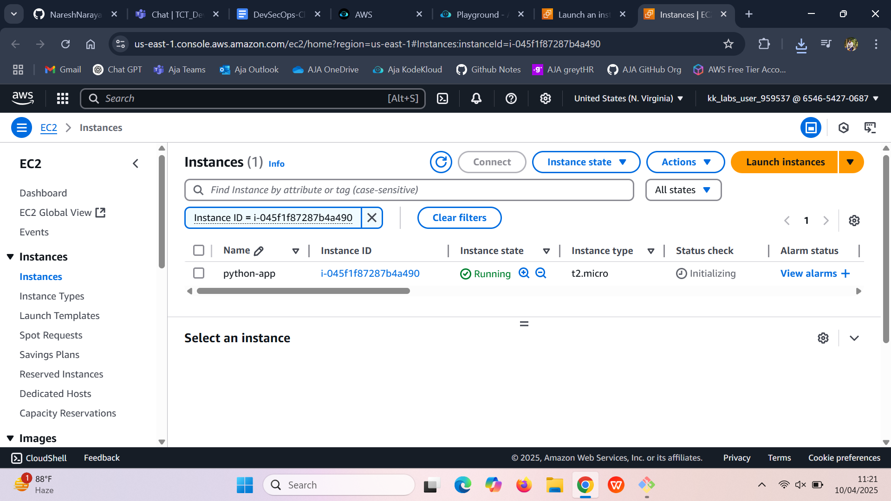
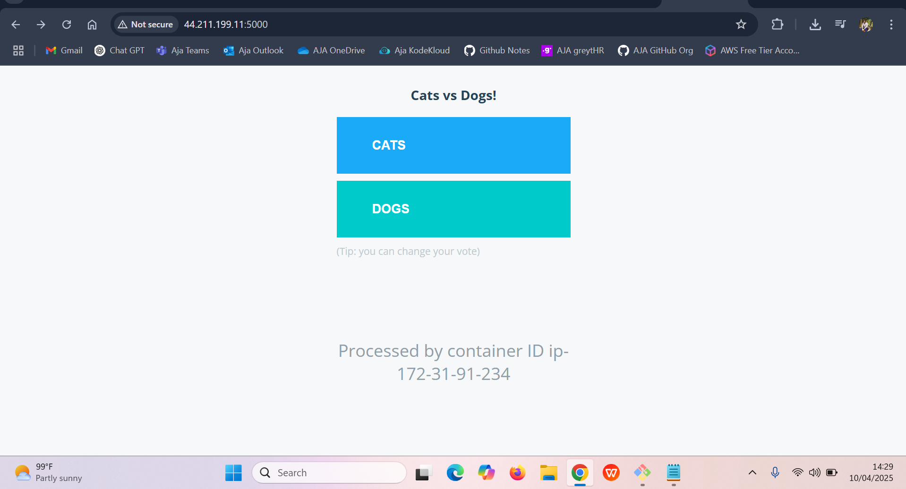

# Vote App - In Python Flask


## Steps:

- Update your system
- Download the app
- Install Python & tools
- Create a virtual environment
- Install dependencies
- Run the app
- View it in your browser

---

## Step 1: Update Your System (in Terminal)

Open your **Terminal** in VS Code (`Ctrl + ~` or `View > Terminal`) and run:

```bash
sudo apt update
```

---

## Step 2: Clone the GitHub Repository

In the terminal:

```bash
git clone https://github.com/Ai-TechNov/example-voting-app.git
cd example-voting-app/vote
```

---

## Step 3: Install Python & Pip

Make sure Python and pip are installed:

```bash
sudo apt install python3-pip -y
sudo apt install python3-venv -y
```

---

## Step 4: Set Up a Virtual Environment

In the `vote/` folder, create a virtual environment:

```bash
python3 -m venv venv
```

Activate it:

```bash
source venv/bin/activate
```

You’ll now see `(venv)` at the beginning of your terminal line.

---

## Step 5: Install Required Python Packages

Upgrade pip (optional but recommended):

```bash
pip install --upgrade pip
```

Then install required packages:

```bash
pip install -r requirements.txt
```

---

## Step 6: Tell Flask Which App to Run

Still in the terminal, run:

```bash
export FLASK_APP=app.py
```

---

## Step 7: Run the App

Run the app locally and make it accessible on your network:

```bash
flask run --host=0.0.0.0 --port=5000
```

---

## Step 8: Open in Browser

In your browser, go to:

```
http://<your-server-ip>:5000
```

> Replace `<your-server-ip>` with your actual IP address (e.g., `192.168.1.20`).

---

## Stopping the Server

To stop the app in the terminal, press:

```
Ctrl + C
```

---

## To Run Again Later

Each time you want to run the app again:

1. Navigate to your folder:

```bash
cd example-voting-app/vote
```

2. Activate the virtual environment:

```bash
source venv/bin/activate
```

3. Set the Flask app:

```bash
export FLASK_APP=app.py
```

4. Start the server:

```bash
flask run --host=0.0.0.0 --port=5000
```

---




