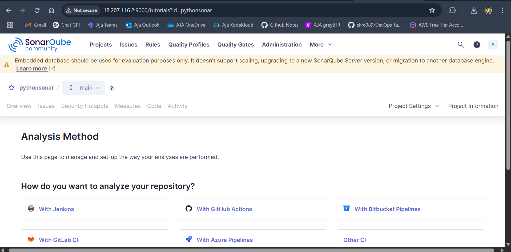

# Car Price Prediction - Project Setup with SonarQube Code Analysis 🚗

Setting up a Python-based car price prediction project and running code analysis using **SonarQube**.

---

## Pre-requisites:

Make sure your system has the following installed:
- Python3
- Git
- Java (JDK)
- unzip utility
- Internet access

---

## Step 1: Clone the Project Repository

Open your terminal and run:

```bash
sudo apt update

git clone https://github.com/AnupCloud/car_price_prediction.git

cd car_price_prediction/
```

---

## Step 2: Install Java JDK (for SonarQube)

SonarQube needs Java to run. Install it using:

```bash
sudo apt install openjdk-11-jdk -y
java -version
```

---

## Step 3: Install SonarScanner

SonarScanner is used to send your code to SonarQube for analysis.

### Download and set up:

```bash
cd ~
wget https://binaries.sonarsource.com/Distribution/sonar-scanner-cli/sonar-scanner-cli-5.0.1.3006-linux.zip
sudo apt install unzip
unzip sonar-scanner-cli-5.0.1.3006-linux.zip
mv sonar-scanner-5.0.1.3006-linux ~/sonar-scanner
```

### Add SonarScanner to PATH:

```bash
nano ~/.bashrc
```

Add the following line to the end of the file:

```bash
export PATH="$PATH:$HOME/sonar-scanner/bin"
```

Then activate the change:

```bash
source ~/.bashrc
```

### Test installation:

```bash
sonar-scanner -v
```

---

## Step 4: Set Up and Run SonarQube Server

These steps are to be done on a separate SonarQube server (already running on `http://18.207.116.2:9000`)

### Install Java 17 (required by latest SonarQube versions):

```bash
sudo apt install openjdk-17-jre-headless
```

### Download and unzip SonarQube:

```bash
wget https://binaries.sonarsource.com/Distribution/sonarqube/sonarqube-25.4.0.105899.zip
unzip sonarqube-25.4.0.105899.zip
cd sonarqube-25.4.0.105899/bin/linux-x86-64/
```

### Start SonarQube server:

```bash
./sonar.sh start
./sonar.sh status
```

Access the dashboard at:  
**http://18.207.116.2:9000**

---

## Step 5: Run Code Analysis on Your Project

Now go back to your project folder and run:

```bash
cd ~/car_price_prediction
sonar-scanner \
  -Dsonar.projectKey=pythonsonar \
  -Dsonar.sources=. \
  -Dsonar.host.url=http://18.207.116.2:9000 \
  -Dsonar.token=sqp_72ba2b330d2502c7662553d0d730e1c518b6ef34
```
--- 





---

## Summary Steps:

### 1. Update System Packages
```bash
sudo apt update
```

### 2. Check Python Version
```bash
python3 --version
```

### 3. Clone the Car Prediction Project Repository
```bash
git clone
 https://github.com/AnupCloud/car_price_prediction.git 

 cd car_price_prediction/
```

### 4. Install Java (Required for SonarQube Scanner)
```bash
sudo apt install openjdk-11-jdk -y
java -version
```

### 5. Download and Extract SonarScanner
```bash
wget <scanner-url>
unzip <file>
mv <folder> ~/sonar-scanner
```

### 6. Add SonarScanner to PATH
Edit your `~/.bashrc` file:
```bash
export PATH="$PATH:$HOME/sonar-scanner/bin"
```
Then reload `.bashrc`:
```bash
source ~/.bashrc
```

### 7. Verify SonarScanner Installation
```bash
sonar-scanner -v
```

### 8. Install Java 17 (Required for SonarQube Server)
```bash
sudo apt install openjdk-17-jre-headless
```

### 9. Download and Unzip SonarQube Server
```bash
wget <sonarqube-url>
unzip <file>
cd <sonarqube-folder>/bin/linux-x86-64/
```

### 10. Start the SonarQube Server
```bash
./sonar.sh start
```

### 11. Run Code Analysis with SonarScanner
```bash
sonar-scanner \
  -Dsonar.projectKey=<key> \
  -Dsonar.sources=. \
  -Dsonar.host.url=<url> \
  -Dsonar.token=<token>
```

---

**✅ Done!**

