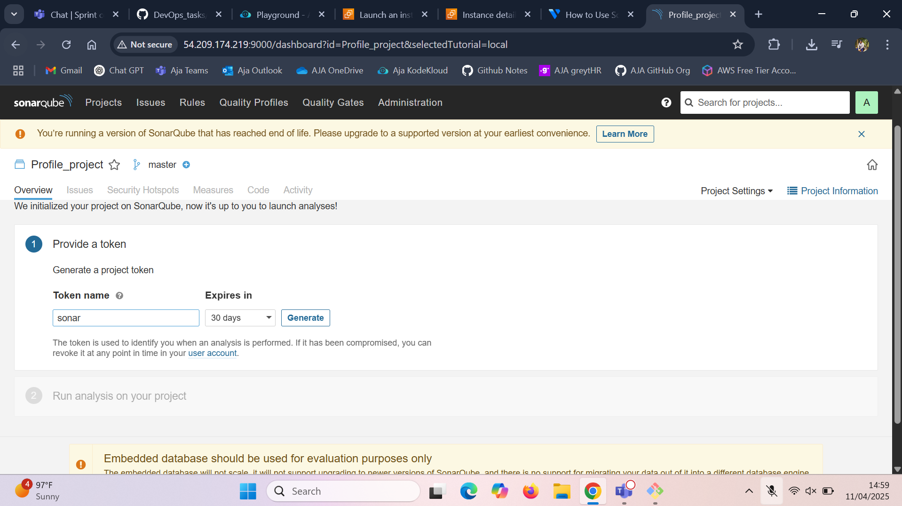
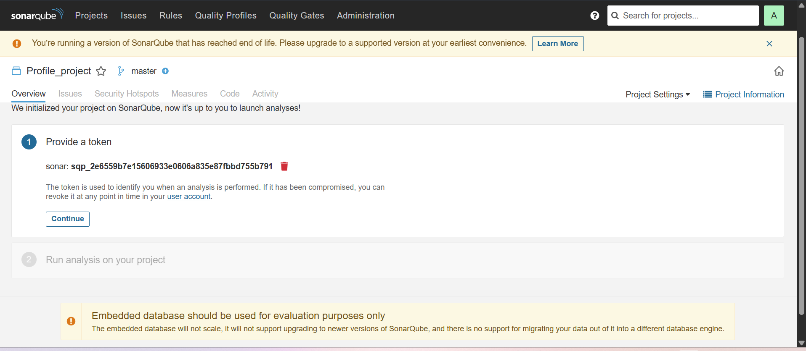
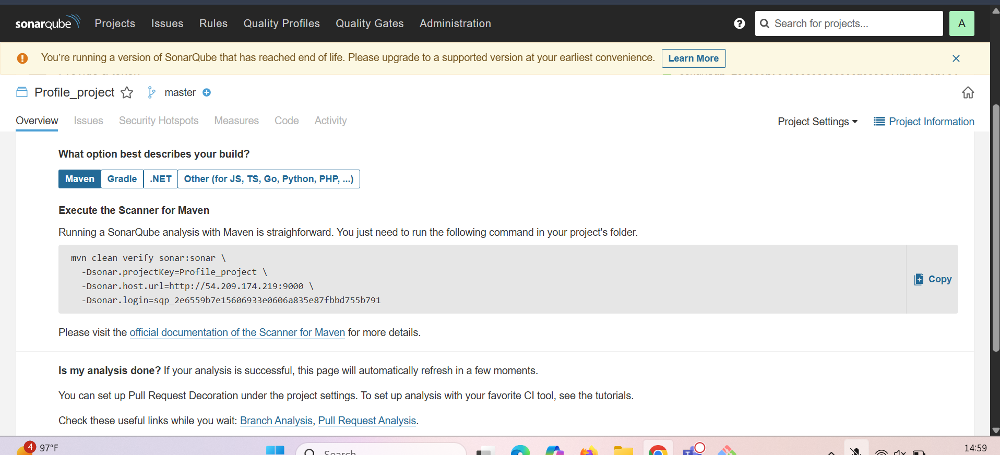
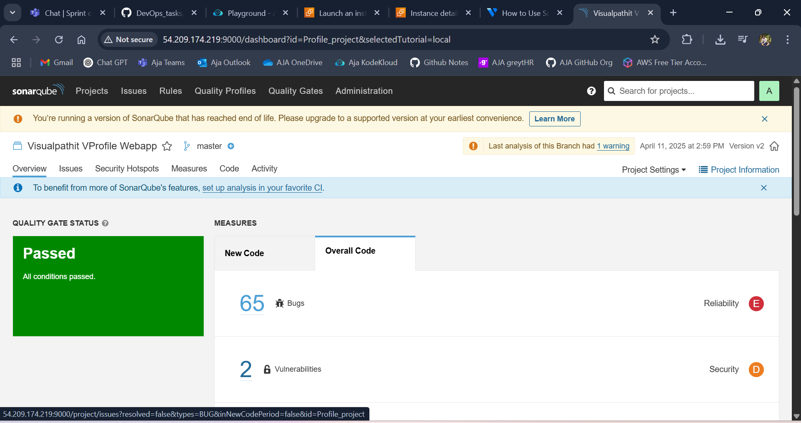
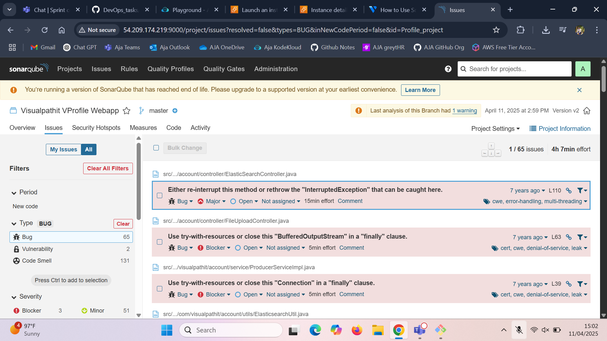
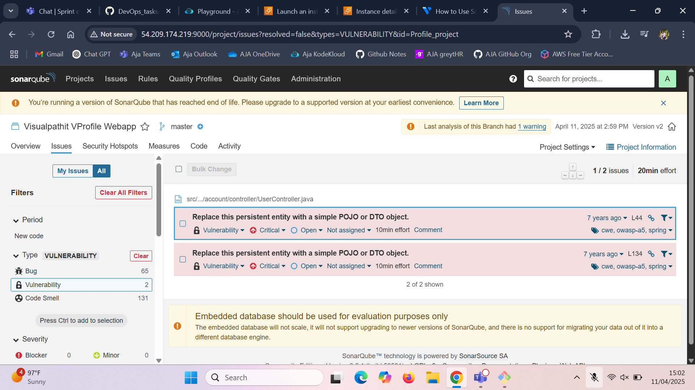
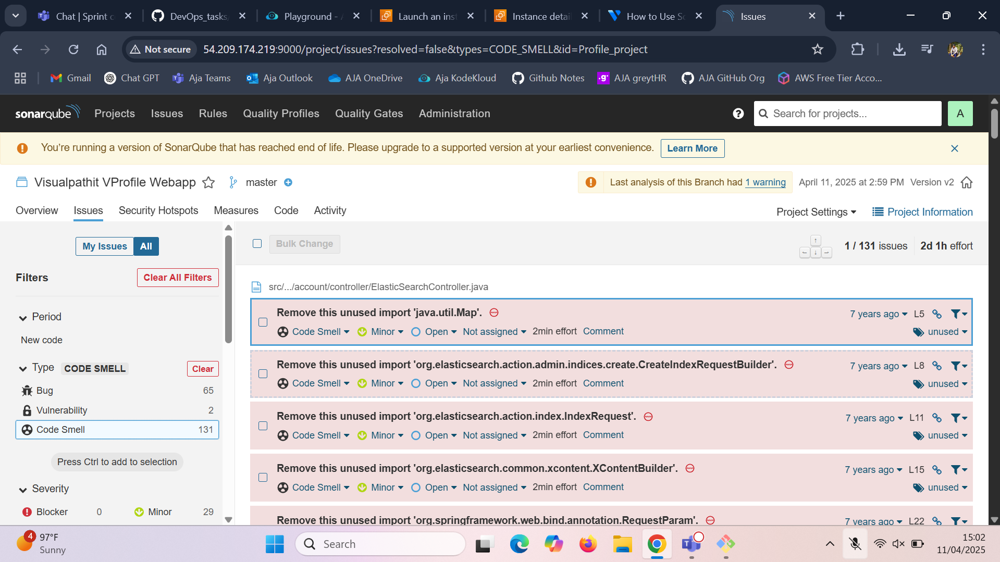
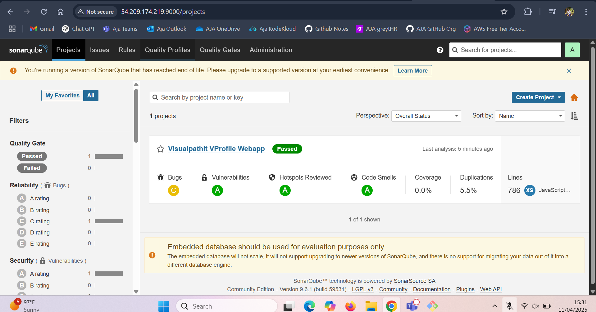
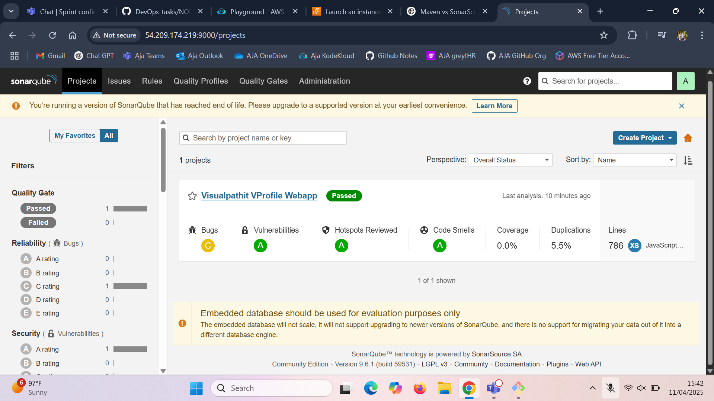

# Java Project Setup with SonarQube Code Quality Checks

Setting up a Java project and performing static code analysis using SonarQube.

---

##  Prerequisites

- Ubuntu/Debian-based OS
- Basic knowledge of terminal commands

---

## Step-by-Step Instructions

### 1. Update Your System

```bash
sudo apt update
```

---

### 2. Install Java 11

Java is required to run both the project and SonarQube.

```bash
sudo apt install java-11 -y
sudo apt install openjdk-11-jre-headless
```

Verify Java installation:

```bash
java --version
```

---

### 3. Install Maven

Maven is the build tool for Java projects.

```bash
sudo apt install maven
```

---

### 4. Install Git

Git is used to download the project from GitHub.

```bash
sudo apt install git
```

---

### 5. Clone the Java Project from GitHub

```bash
git clone https://github.com/Ai-TechNov/profile-project.git
cd profile-project/
```

---

### 6. Build the Project

Compile and package the project using Maven:

```bash
mvn package
```

---

### 7. (Optional) Install `tree` to View Project Structure

```bash
sudo apt install tree
tree
```

---

##  Set Up SonarQube

### 8. Download and Set Up SonarQube

#### a. Download SonarQube:

```bash
wget https://binaries.sonarsource.com/Distribution/sonarqube/sonarqube-9.6.1.59531.zip
```

#### b. Unzip the Package:

```bash
sudo apt install unzip
unzip sonarqube-9.6.1.59531.zip
```

#### c. Navigate to Startup Scripts:

```bash
cd sonarqube-9.6.1.59531/bin/linux-x86-64/
```

#### d. Start the SonarQube Server:

```bash
./sonar.sh start
```

Check server status:

```bash
./sonar.sh status
```

---

### 9. Run SonarQube Analysis on the Project

Return to your project directory:

```bash
cd ~/profile-project/
```

Run analysis with Maven (replace with your own `sonar.login` token):

```bash
mvn clean verify sonar:sonar \
  -Dsonar.projectKey=Profile_project \
  -Dsonar.host.url=http://54.209.174.219:9000 \
  -Dsonar.login=sqp_2e6559b7e15606933e0606a835e87fbbd755b791
```

---

### 10. View the Code Quality Report

Visit the following URL in your browser:

```
http://54.209.174.219:9000
```

Log in and view the project’s code quality dashboard.

---



























---


**Done!** Your Java project is now built and analyzed with SonarQube.


